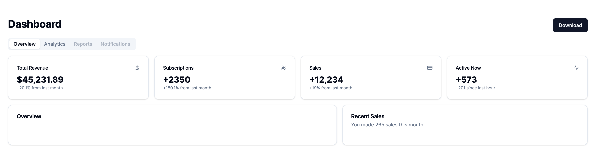

# Create Nextjs App

```bash
npx create-next-app@latest nextjs-shadcn-iu --typescript --tailwind --eslint
```

# Init the shadcn ui

```bash
npx shadcn-ui@latest init 
```

# Get Started

Clone the repo and install dependencies. Lets.

```bash
npm i
npm run dev
Local:        http://localhost:3000
```

# Add a Component

```bash
npx shadcn-ui@latest add <componentName>

example: npx shadcn-ui@latest add accordion
https://ui.shadcn.com/docs/components/accordion
```

# Images



